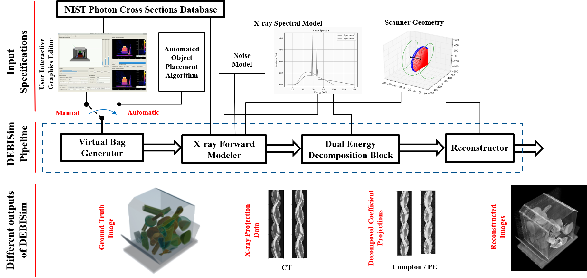
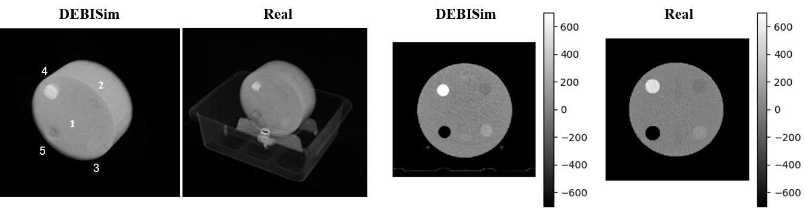
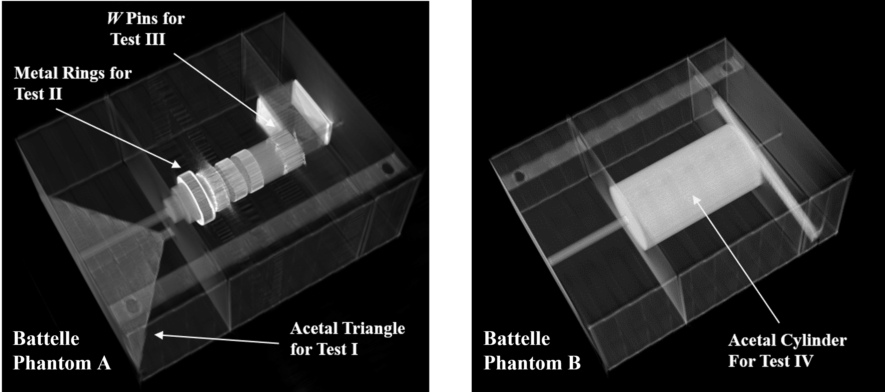
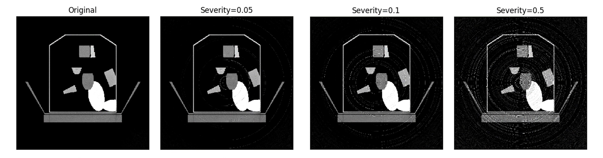
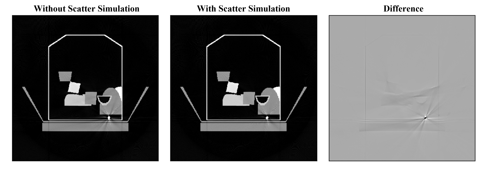
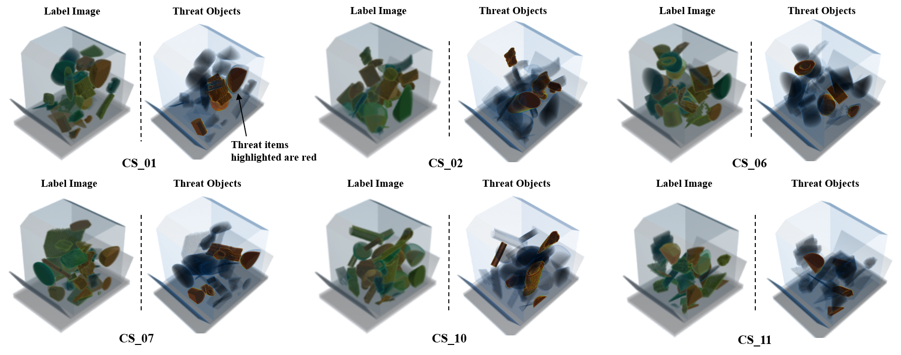
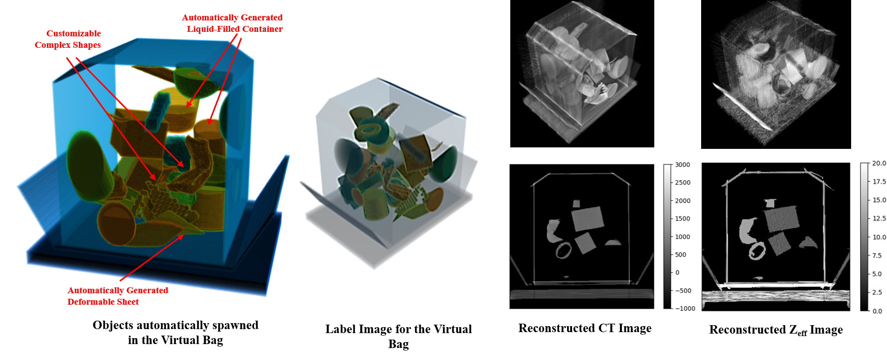

### DEBISim2.0 - A Simulation Pipeline for Dual Energy CT-based Baggage Inspection Systems

DEBISim (Dual Energy Baggage Image Simulator) is a Python-based 3D CT Simulation library for Single and Dual energy X-ray image data generation. This library is designed to aid in the development, testing and evaluation of Single and Dual Energy CT based target detection systems for airport baggage screening and other CT imaging applications requiring anomaly detection. 

The software package presents a simulation pipeline for developing algorithms for baggage inspection scanners and in other similar security screening applications. CT-based target detection systems in general require generating testing and training data by packing and scanning a large number of real bags with real threat materials. Since DEBISim incorporates a complete simulation of physical phenomena involving X-ray transmission, attenuation and detection and also provides a user-configurable scanner geometry, it is an alternative to physically scanning CT baggages for data generation. DEBISim also knows about the wide range of materials (and threat materials) that are encountered in a scanned bag and includes support for simulating them while packing virtual bags.

The DEBISim package includes the following features:

 - Fast and automated generation of randomized baggage CT datasets for target material detection.
 - User-specified baggage data generation using baggage/phantom templates.
 - Generation of single and dual-energy CT X-ray projection data and output images.
 - Support for spiral cone-beam CT scanner geometries typically used in security screening as well as for creating user-specified CT scanner models.
 - GUI support for both randomized and user-interactive data generation for baggage inspection (lim. access).
 - User-interactive graphical support for generating simulated test cases of 3D baggage CT volumes  (lim. access).

This repository consists of the latest version of our software (DEBISim2.0). The original DEBISim simulator is a Python2-based package which can be downloaded from this [link](https://engineering.purdue.edu/RVL/debisim/html/attachments/DebiSim-1.2.0.tar.gz). The complete description of DEBISim, its modules and its usage can be obtained from its official [webpage](https://engineering.purdue.edu/RVL/debisim/html/mainpage.html#setup-and-installation).



DEBISim2.0 is a limited access, open-source version of our simulator which is Python3-based and has the following additional features:

- simulation of 2D baggage cross-sections of bags as well as 3D volumetric renderings.
- controlled generation of metal objects / clutter in baggage scans for studying metal artifact reduction.
- controlled generation of target materials within simulated bags for X-ray based material detection.
- simulation of second-order artifacts including ring, motion and scatter artifacts.
- plotting and analysis of the material-based statistics of the scanned bag during simulation.

To know more about the mechanism behind the simulator, read our supporting research article: '[DEBISim: A simulation pipeline for dual energy CT-based baggage inspection systems](https://content.iospress.com/articles/journal-of-x-ray-science-and-technology/xst200808)'.

#### Requirements

- Python3  (>v3.7.x)
- CUDA Toolkit (>=v9.2)
- For GPU Support: PyTorch (>=v1.0.1), pyGpufit (>=v1.1.0)
- The ASTRA toolbox (>=1.9.0)
- The FreeCT_wFBP reconstruction library

#### Setup and Installation

##### Download
The code package can be cloned from the git repository using:

```bash
git clone https://github.com/avm-debatr/debisim2.git
```

Before running the simulation scripts, the following steps must be taken for installation:

##### Anaconda Environment Setup

The conda environment for the code can be created using the `environment.yaml` file provided with the scripts.

```bash
cd debisim2
conda env create --name debienv --file=environment.yaml
conda activate debienv
```
The following packages need to be downloaded additionally as per the simulation requirements:

##### ASTRA Toolbox

- This toolbox is essential for the Forward Model block to work. For use with DEBISim, ASTRA (mostly written in C) needs to be installed from source with Python bindings. Check the ASTRA homepage for [Linux installation](https://www.astra-toolbox.com/docs/install.html#linux-from-source) for instructions on how to install the package in your own machine.
- Make sure that the machine has CUDA (5.5 or higher) installed on it before installing ASTRA.

##### Gpufit
PyGpufit is required to speed up the operation of the dual energy decomposition block in the simulation pipeline. This package must be installed and set up as follows:

- Download the Gpufit package from GitHub:
```bash
git clone https://github.com/gpufit/Gpufit.git Gpufit
```
- Add the files `compton_pe.cuh`, `kn_pe.cuh`, `models.cuh` from `deps/gpufit/` directory in our repo to `<path to gpufit>/Gpufit/models/`  
- Replace the file `<path to gpufit>/Gpufit/constants.cuh` with the one in `deps/gpufit/`.
- Replace the file `<path to gpufit>/Gpufit/python/pygpufit/gpufit.py` with the one in `deps/gpufit/`.
- Complete the Gpufit installation:

```bash
cd Gpufit
mkdir build
cd build
cmake -DCMAKE_BUILD_TYPE=RELEASE ../
make
```

- Finish by installing the Python bindings for Gpufit:

```bash
cd pyGpufit/dist
pip install pyGpufit-1.2.0-py2.py3-none-any.whl
```

##### FreeCT

- Installing this library allows performing fast FBP reconstructions from Spiral CBCT projection data. The library can be installed from the FreeCT_wFBP [repository](https://engineering.purdue.edu/RVL/debisim/html/attachments/packages/freect.tar.gz). 
- For reference on installing the library, the user can refer to the compiled package and corresponding [documentation](https://engineering.purdue.edu/RVL/debisim/html/attachments/packages/Documentation.pdf).
- To run the example scripts using FreeCT would require the addition of a few filters to the FreeCT library. Copy these filters from the `deps/freect/` directory to the location /usr/local/FreeCT/FreeCT_WFBP/resources/filters/ or whichever path has been assigned to the library. Run `sudo make install` again to build the library.

##### Pre-saved models

The pre-saved custom shapes and phantom shape lists can be downloaded from this [link](https://engineering.purdue.edu/RVL/debisim/html/attachments/github/examples.tar.gz) into the `examples/` directory to run the `simulate_ct_phantoms.sh` script for phantom simulation.

Simulation examples for different scanner configurations described in `configs/` directory can be downloaded from this [link](https://engineering.purdue.edu/RVL/debisim/html/attachments/github/results.tar.gz) into the `results/` directory.

#### Usage

##### Baggage Simulation 
Baggage datasets can be simulated using DEBISim by running the following command:

```bash
python run_dataset_generator.py --config=configs/config_default_parallelbeam_2d.py --sim_dir=results/example_default_parallelbeam_2d/ --num_bags=10
```

The parameters for running the simulation are specifed in a configuration file `config.py` which provides the details for the scanner setup, the scanner geometry. the X-ray source and the baggage configuration. Examples of config files are provided in the `configs/` directory and can be refered to by the user to create their own configurations for baggage simulation.

##### CT Phantom Simulation

CT Phantoms can be simulated with DEBISim using phantom shape lists provided in `examples/` directory. This is done using:

```bash
./simulate_ct_phantoms.sh -p acr -o results/simulation_acr/ -s sensation_32
```

The argument `-p` specifies the phantom (`acr` - ACR Medical Scanning Phantom, `battelle_a` - Battelle A Security Phantom, `battelle_b` - Battelle B Security Phantom) while the argument `-s` specifies the scanner used for simulation (`sensation_32 | definition_as | force | default`).





##### Artifact Simulation

A new feature in DEBISim2.0 is the generation of second order artifacts. To test the simulation of these artifacts the following script can be run:

```bash
./test_simulator_for_artifact_generation.sh -t ring -i results/example_for_artifact_simulation/ -o results/test_ring_artifacts/ -s sensation_32 -z 59 
```

The argument `-t` specifies the type of artifact (`ring` - Ring artifacts, `motion` - Motion artifacts, `scatter` - Scattering artifacts) while the argument `-z` specifies the slice to be processed. The argument `-i` is used to specify the source simulation directory for motion and scatter artifacts.


###### Ring Artifacts



###### Scattering Artifacts



The current version of DEBISim 2.0 does not contain the GUI support as in the original DEBISim - to access these, please contact the authors.

#### Simulation Examples

##### 3D Baggage Image Examples from a Simulated Dataset 


##### A closer Look at the objects spawned within a simulated bag 


#### License
Public Domain, Copyright © 2023, Robot Vision Lab, Purdue University.

#### Citation

All publications using DEBISim or its datasets must cite the following paper:

```bibtex
@article{manerikar2021debisim,
  title={DEBISim: A simulation pipeline for dual energy CT-based baggage inspection systems}, 
  author={Manerikar, Ankit and Li, Fangda and Kak, Avinash C}, 
  journal={Journal of X-Ray Science and Technology}, 
  volume={29},
  pages={259--285},
  year={2021}
}
```


#### Contact

The authors can be contacted at [amanerik@purdue.edu](amanerik@purdue.edu) (Ankit Manerikar) and [li1208@purdue.edu](li1208@purdue.edu) (Fangda Li). 
